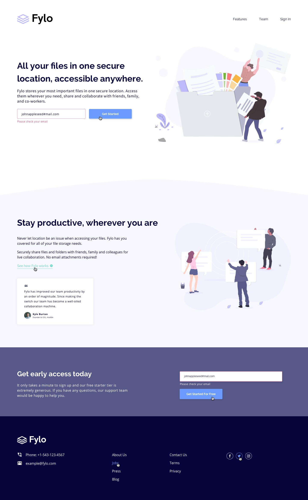

# Olá! Este é meu primeiro desafio feito do 0!

O <a href="www.frontendmentor.io">Frontendmentor</a> proporciona as imagens e uma imagem de como a interface deve ficar, e o usuário tem o desafio de transformar o layout em código.
Fiz o layout buscando deixar o mais fiél possível com os designs desktop e mobile, mesmo não tendo as medidas dos elementos.

## Preview de como ficou:

## Imagens que o <a href="www.frontendmentor.io">Frontendmentor</a> forneceu:

## Desktop design

## Active states

## Design mobile

